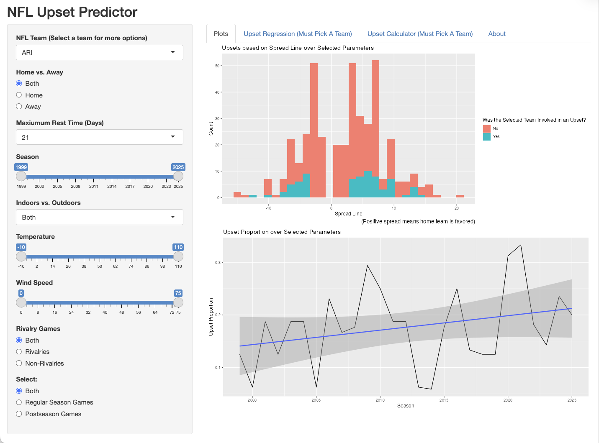

# NFL Upset Predictor
An interactive R Shiny application exploring NFL upsets against the point spread.
The app uses historical NFL game data and logistic regression models to estimate
the probability that a team is involved in an upset or is upset by another team.

A game is considered an upset when a team is favored by at least 3.5 points
but does not win the game.

## Application Preview

The application provides interactive filtering and visualizations for exploring NFL upsets against the point spread.

## Course Project

This project was developed collaboratively as part of an 
undergraduate statistical computing course at the University of Michigan

## Packages and Data

The application uses the following R packages:

- `tidyverse`
- `shiny`
- `modelr`
- `nflreadr` (Used by `prep.R` to obtain NFL data)

The following data files are included in the repository:

- `nflgames.RData` (Course-provided NFL game data)
- `master_nflschedule.rds` (processed regular-season and postseason data used by the Shiny application)

`nflgames.RData` was provided as part of the course and contains NFL game data originally obtained from the nflverse project using `nflreadr`. 
The original code used to create this `.RData` file was not provided with the course materials.\
`prep.R` contains the code developed for this project to process the course-provided data and create the additional, processed dataset used by the application.

## Project Overview
- The application allows users to explore NFL upsets from 1999–2025 while 
filtering games by: team, home vs. away, year, rivalries, regular season vs. postseason games, rest time, indoors vs. outdoors, temperature, and wind speed
    - Selecting "All" or "Both" will keep all data
    - Criteria involving empty data is handled with validate(need())
    - Filters are reactive to every change and are handled through reactive({})
 - Displays visuals of upsets against the spread, and upset proportion over the years 
 (An upset is when a team is favored by at least 3.5 points in the spread line and does not win that game)
 
## Statistical Methods

Two logistic regression models are used:

1. **Upset involvement:** estimates the probability that a team is involved
   in an upset, either by upsetting an opponent or being upset itself.

2. **Being upset:** estimates the probability that a selected team is upset
   by another team.
   
**Note:** In both models, indoor games receive temperature and wind speed of 0 to avoid missing values in the regression models.

The models are available in the **Upset Regression** and **Upset Calculator** 
tabs of the application, respectively, and require a specific team to be selected.

These models are also used to estimate the probability of a future upset (See limitations below).
 
## How to Use the App

- Use the controls in the sidebar to filter the games by team, season,
location, game type, weather conditions, and other characteristics.
- The visualizations and regression models are reactive, and they update based on the selected
filters.
- Temperature and wind values used to calculate the probability of an upset
  correspond to the maximum values selected using the "Wind Speed" and
  "Temperature" sliders.

## How to Run the App (Local)
1. Clone or download this repository
2. Open the project file in RStudio
3. Install the required R packages, if needed
4. Open `shinyapp.R`
5. Click **Run**

The required data files are included in the `data/` directory, so
running `prep.R` is not necessary to launch the existing application.

`prep.R` can be run to reproduce the NFL game datasets derived from
`nflgames.RData`.

**Note:** `prep.R` retrieves NFL data from `nflreadr`, 
so the resulting dataset may change slightly if the underlying NFLverse data are updated. 
The `master_nflschedule.rds` file included in this repository represents the version used by the current application.
 
## Limitations

- Some teams joined the NFL or relocated after 1999, so historical data may
  be incomplete for certain franchises.
- Predictions involving unusually high temperatures or wind speeds may be
  unreliable because relatively few historical games occurred under these
  conditions.
- The prediction model should not be interpreted as a guarantee of future
  game outcomes.
  
## File Layout
nfl-upset-predictor/\
├── shinyapp.R            
├── prep.R          
├── data/\
│   └── master_nflschedule.rds\
│   └── nflgames.RData\
└── README.md\

## Contributors

This project was developed collaboratively as part of an undergraduate
statistical computing course at the University of Michigan

- George Kobrossy
- Duncan Lowe
